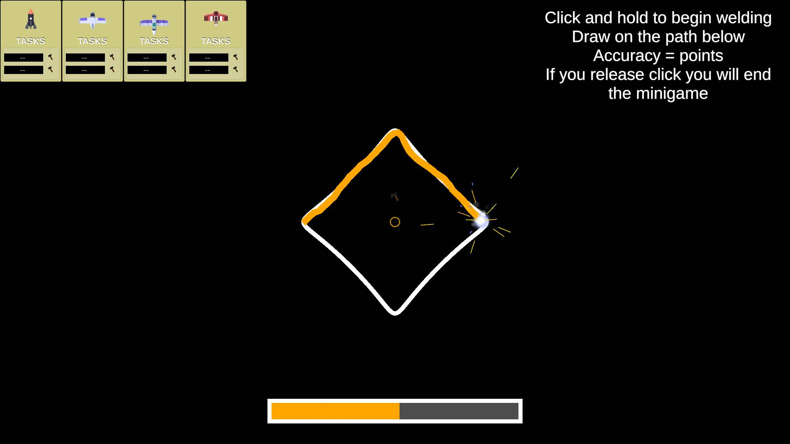
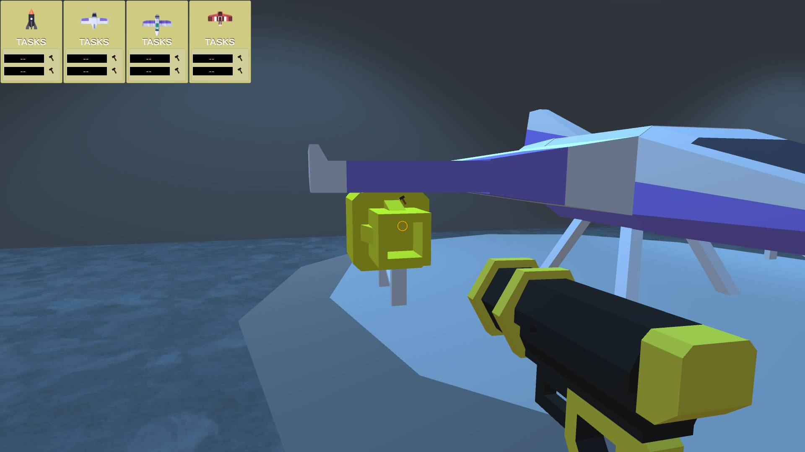
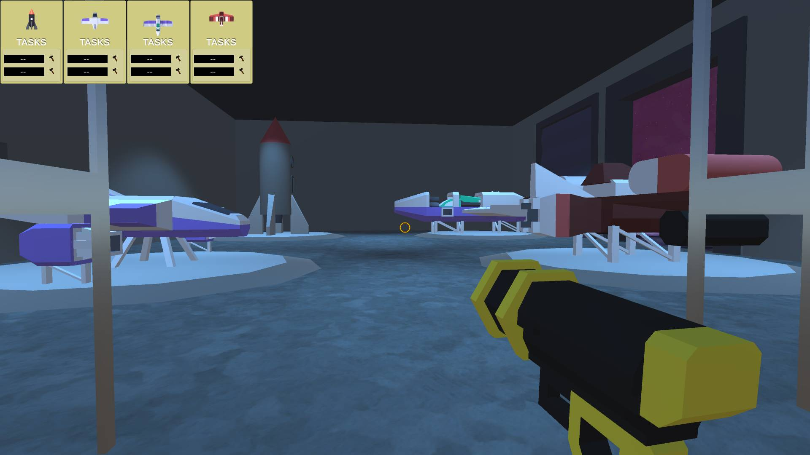

# GGJ2020 Project - GALAK STATION
Game made during Global Game Jam 2020 at Politechnika Poznańska jam site.
Made solo with Unity, Asset Forge, resources from: freesound.com - https://freesound.org/people/Tomlija and https://freesound.org/people/kingof_thelab and Sebastian Lague's Path Creator https://assetstore.unity.com/packages/tools/utilities/b-zier-path-creator-136082.

